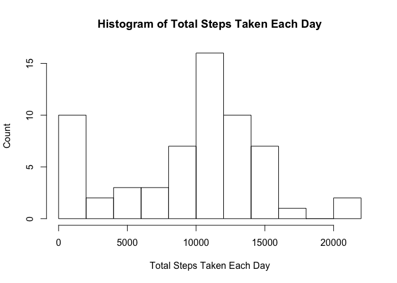
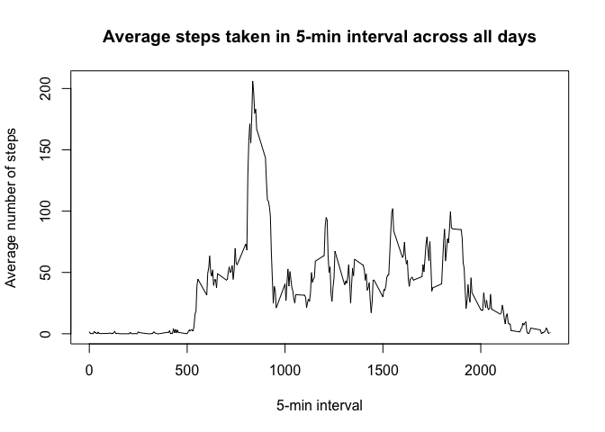
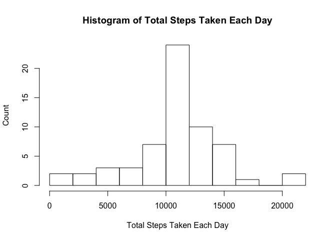
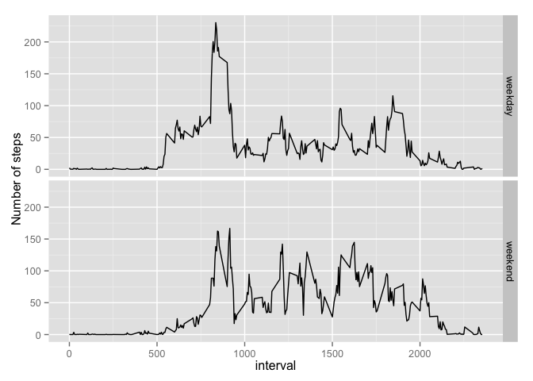

# Reproducible Research: Peer Assessment 1


## Loading and preprocessing the data


```r
unzip('activity.zip')
data<-read.csv('activity.csv')
```

## What is mean total number of steps taken per day?


1.Calculate the total number of steps taken per day


```r
TotalSteps<-tapply(data$steps,data$date, sum, na.rm=TRUE)
```


2.Make a histogram of the total number of steps taken each day


```r
hist(TotalSteps,breaks=10,xlab='Total Steps Taken Each Day',ylab='Count',main='Histogram of Total Steps Taken Each Day')
```

 


3.Calculate and report the mean and median of the total number of steps taken per day


```r
mean(TotalSteps)
```

```
## [1] 9354.23
```


```r
median(TotalSteps)
```

```
## [1] 10395
```


## What is the average daily activity pattern?


```r
interval<- aggregate(steps~interval, data,mean,na.rm=TRUE)

plot(interval$interval,interval$steps,type='l',xlab='5-min interval',ylab='Average number of steps',main='Average steps taken in 5-min interval across all days')
```

 

which interval contains maximum number of steps?


```r
interval[which.max(interval$steps),]
```

```
##     interval    steps
## 104      835 206.1698
```


## Imputing missing values


1.Calculate and report the total number of missing values in the dataset (i.e. the total number of rows with NAs)

```r
totalNA<-sum(is.na(data$steps))
```

2.Devise a strategy for filling in all of the missing values in the dataset: mean for that day
3.Create a new dataset "NoNa" that is equal to the original dataset but with the missing data filled in.


```r
NoNa<-data
for (i in 1:nrow(NoNa) ) {
    if (is.na(NoNa$steps[i]) ){
      int<-NoNa$interval[i]
      steps<-interval[interval$interval==int,]
      NoNa$steps[i]<-steps$steps
    }
}
```

4.Make a histogram of the total number of steps taken each day and Calculate and report the mean and median total number of steps taken per day.


```r
TotalSteps2<-tapply(NoNa$steps,data$date, sum)
hist(TotalSteps2,breaks=10,xlab='Total Steps Taken Each Day',ylab='Count',main='Histogram of Total Steps Taken Each Day')
```

 

```r
mean(TotalSteps2)
```

```
## [1] 10766.19
```

```r
median(TotalSteps2)
```

```
## [1] 10766.19
```

Both mean and median are different from the first part. After imputing missing data, both median and mean are higher, because when they were missing, they were considered as zero, thus lowering the mean and mean values; when they were replaced by the mean of that interval, the values are definitely higher than zero, thus increasing the values.


## Are there differences in activity patterns between weekdays and weekends?

1. Create a new factor variable in the dataset with two levels


```r
NoNa$weekendORweekday<-weekdays(as.Date(NoNa$date))
for (i in 1:nrow(NoNa)){
    if (NoNa$weekendORweekday[i] %in% c('Saturday','Sunday')) 
      {NoNa$weekendORweekday[i]<-'weekend'}
    else {NoNa$weekendORweekday[i]<-'weekday'}
}
NoNa$weekendORweekday<-as.factor(NoNa$weekendORweekday)
```

2.Make a panel plot containing a time series plot (i.e. type = "l") of the 5-minute interval (x-axis) and the average number of steps taken, averaged across all weekday days or weekend days (y-axis). 


```r
interval2<- aggregate(steps~interval+weekendORweekday, NoNa,mean)
library(ggplot2)

ggplot(interval2, 
       aes(interval, steps)) + 
       geom_line() + 
       facet_grid(weekendORweekday ~ .) + 
       xlab('interval') + 
       ylab('Number of steps')
```

 


